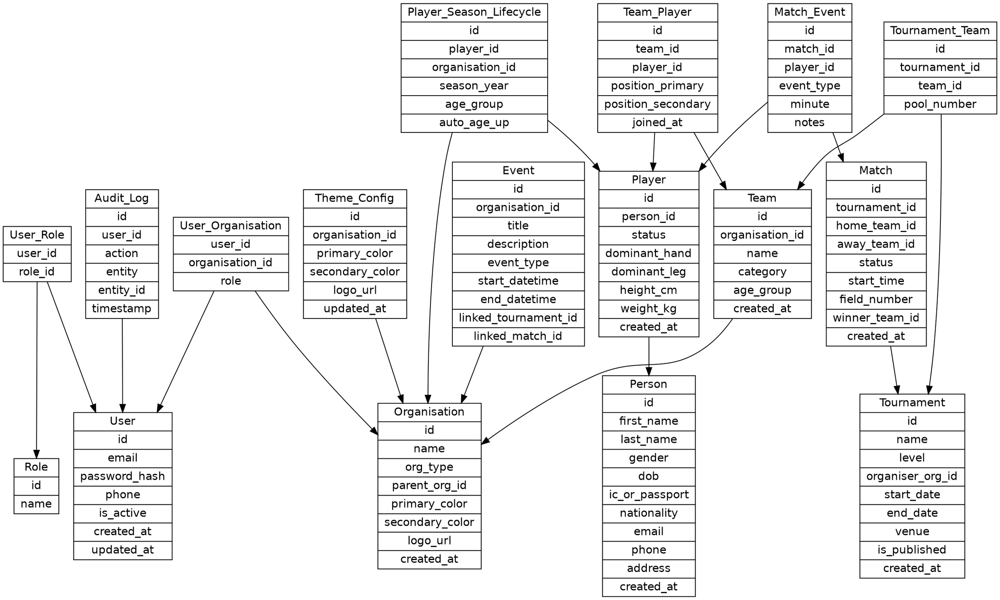

# Refined ERD Documentation - AthleticaOS Rugby

## 1. Overview
This document details the Entity-Relationship Diagram (ERD) for the AthleticaOS Rugby module. The schema is designed to support a hierarchical organisation structure, comprehensive player lifecycle management, and detailed match event logging.

## 2. Entity Relationships

### 2.1 User & Organisation Hierarchy
- **User <-> Role**: Many-to-Many relationship managed by `User_Role`. Allows users to have multiple system-wide roles.
- **Organisation (Self-Referencing)**: `parent_org_id` allows for an infinite hierarchy (National -> State -> District -> Club).
- **User <-> Organisation**: Many-to-Many via `User_Organisation`. A user can be an Admin for a Club and a Coach for a specific Team.

### 2.2 Player Identity & Lifecycle
- **Person -> Player**: One-to-One. `Person` holds PII (Personal Identifiable Information) which is strictly protected. `Player` holds rugby-specific attributes.
- **Player -> Player_Season_Lifecycle**: One-to-Many. Tracks a player's status and age group for each specific year/season. This enables historical tracking of a player's development.

### 2.3 Team Structure
- **Organisation -> Team**: One-to-Many. An organisation (Club/School) can have multiple teams (U15, U18, Senior).
- **Team <-> Player**: Many-to-Many via `Team_Player`. A player can belong to multiple teams over time, or even concurrently (e.g., School Team and State Team).

### 2.4 Tournament & Matches
- **Organisation -> Tournament**: One-to-Many. An organisation (e.g., State Union) creates and owns tournaments.
- **Tournament -> Team**: Many-to-Many via `Tournament_Team`. Tracks which teams are participating in a specific tournament.
- **Tournament -> Match**: One-to-Many. A tournament consists of multiple matches.
- **Match -> Match_Event**: One-to-Many. Each match has a log of events (scores, cards, subs).

## 3. Diagram Source
The following Graphviz DOT definition represents the refined schema:

