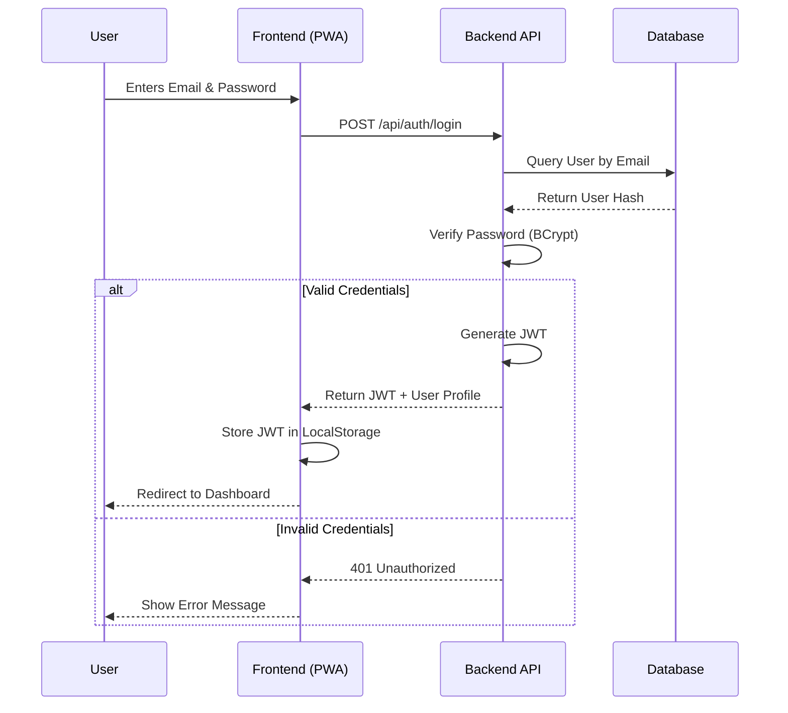
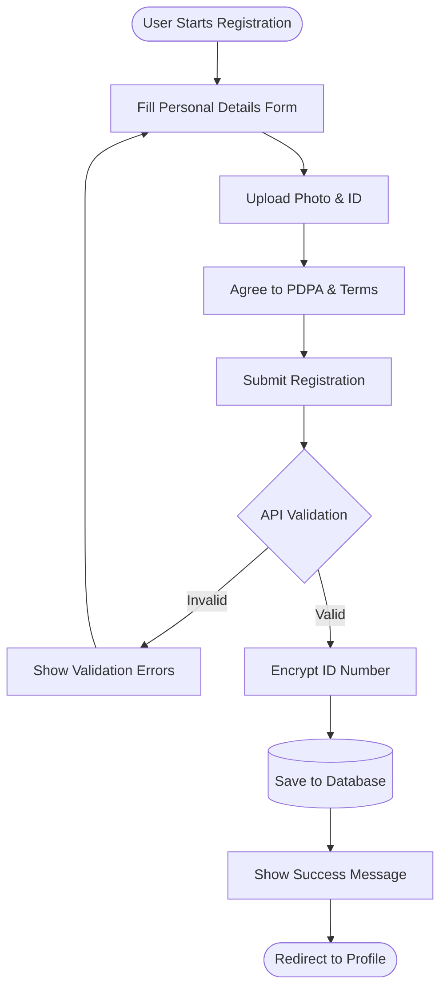
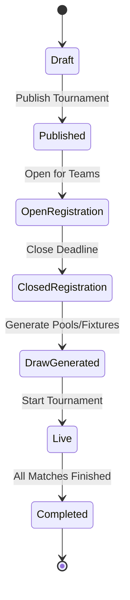
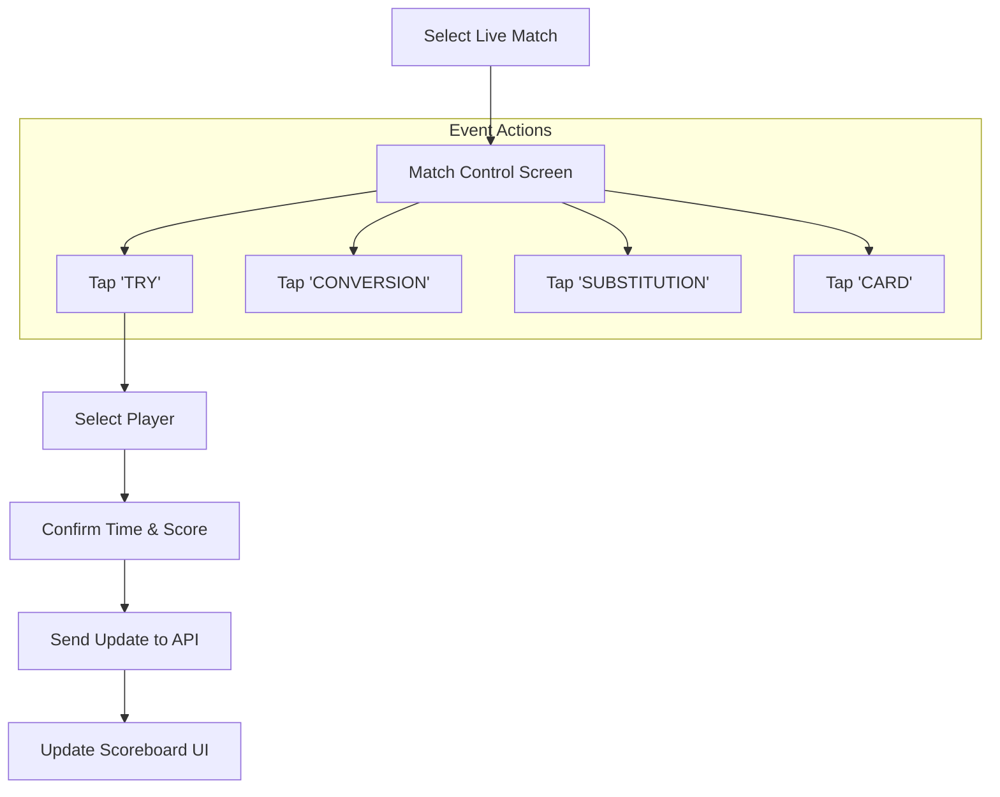

# UX Flow Diagrams - AthleticaOS Rugby

## 1. Login Flow



## 2. Player Registration Flow



## 3. Organisation Setup Flow (Admin)

```mermaid
graph LR
    Login[Admin Login] --> Dashboard
    Dashboard --> CreateOrg[Create Organisation]
    CreateOrg --> OrgDetails[Enter Name, Type, Logo]
    OrgDetails --> ParentOrg[Select Parent Org (if any)]
    ParentOrg --> Save[Save Organisation]
    Save --> Invite[Invite Admins/Coaches]
```

## 4. Tournament Management Flow



## 5. Match Event Capture (Mobile)



## 6. Viewing Standings & Stats

1. **User** navigates to "Tournaments" tab.
2. **User** selects a specific Tournament.
3. **System** displays Tabs: "Fixtures", "Standings", "Stats".
4. **User** clicks "Standings".
5. **System** fetches Pool Tables (Points, W/D/L, PD).
6. **User** clicks "Stats".
7. **System** fetches Top Try Scorers, Top Point Scorers.
